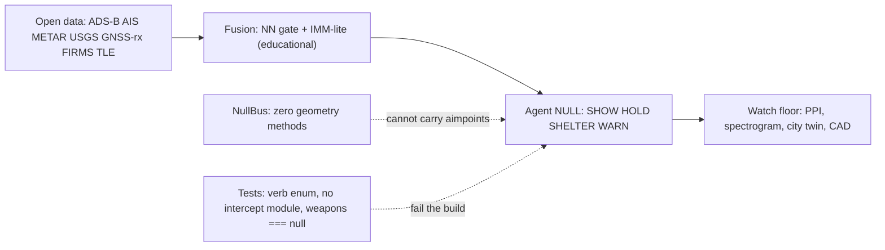

# PALLADIUM NULL

**The operating picture that cannot fire.**

> ⚠️ **DUAL-USE WARNING** — Sensing physics is dangerous in the real world. This repository refuses the harm path. It contains no fire-control types, no weapons bus, no aimpoint geometry, no intercept module, and no transmitter. It fuses open, receive-only observations into a civil-defense watch floor that can tell a city to take shelter. It cannot aim. It cannot launch.

## Why Null

Fragments exist: ADS-B aggregators, AIS maps, NOAA/EUMETSAT weather, USGS seismic, GNSS interference dashboards, space-debris visualizers, closed digital-twin demos.

**Nobody has shipped a single beautiful, open, receive-only, multi-domain civil-defense operating picture with:**

1. A formally empty weapons interface (`interfaces.weapons === null` in CAD, no `WeaponsBus` type)
2. A passive sensor CAD lab (no transmitter, only receive elements)
3. An agentic watchstander that only sheds load and names attention — verbs frozen to `SHOW | HOLD | SHELTER | WARN`
4. Open-data fusion (ADS-B, AIS, METAR, seismic, GNSS integrity, wildfire IR, debris TLEs)
5. A city-shelter digital twin (where to go, not what to shoot)
6. WebGPU + CAD + PPI + spectrogram in one SPA
7. Proof artifacts: `typeof intercept === "undefined"` — tests that fail the build if a fire-control path appears

> **Market gap:** *OpenSky shows airplanes. MarineTraffic shows ships. USGS shows quakes. Nothing open fuses them into one defensive operating picture — and nothing else proves, in its type system and its tests, that it cannot fire. Palladium Null is that proof with a UI.*

## Screenshots (placeholders)

| View | Placeholder |
|------|-------------|
| Watch floor (full) | `docs/screenshots/watch-floor.png` |
| CAD — PN-LISTEN-1 | `docs/screenshots/cad-array.png` |
| PPI + Spectrogram | `docs/screenshots/ppi-spec.png` |
| City twin — Meridian Bay | `docs/screenshots/city-twin.png` |
| Agent NULL panel | `docs/screenshots/agent-null.png` |

*(Render locally to populate — see Quickstart.)*

## Quickstart

```bash
# 1) Clone
git clone https://github.com/your-org/palladium-null.git
cd palladium-null

# 2) Install (uses workspace-local portable Node if needed)
npm install

# 3a) Dev — hot-reload frontend + API on one port (proxied)
npm run dev
# → http://localhost:5173  (API at :8787)

# 3b) Production build + serve on one port
npm start
# → http://localhost:8080  (serves dist/ + API)

# 4) Tests
npm test
# → vitest run (doctrine, physics, cad, agent)

# 5) Type-check (optional)
npm run typecheck
```

**One exposed port.** `GET /` always serves the lab (never “Cannot GET /”).

## Architecture



### Module boundaries (src/)

| Module | Responsibility |
|--------|----------------|
| `doctrine/` | Verb enum, NullBus singleton, forbidden keys/modules, proof line |
| `physics/` | Speed-of-light identities, Doppler, TDOA, radio horizon, SNR literacy, GNSS RAIM toy, seismic intensity toy, tsunami ETA, orbital mechanics — all cited to open textbooks/standards |
| `cad/` | PN-LISTEN-1 JSON model + loaders; `interfaces.weapons === null` |
| `fusion/` | Seeded world simulator, track kinds, NN-gate + IMM-lite fusion, hazards (flood, wildfire, seismic, tsunami, GNSS) |
| `agent/` | `evaluateAgent()` — scoring, display budget, attention, shelter recommendation, verb emission, decision log |
| `twin/` | Meridian Bay city: 12 shelters, 3 hospitals, 2 bridges, flood polygon, tsunami toy |
| `scopes/` | PPI, spectrogram, city map, Three.js CAD scene, WebGPU point cloud |
| `ui/` | DOM helpers, styling |

### Data flow

```
Open data (or synthetic) → World.step() → Tracks + Hazards
         ↓
Agent.evaluate() → { shown, held, attention, shelter, verbs, log }
         ↓
UI renders: CAD ring, PPI sweep, spectrogram waterfall, city map, WebGPU points
```

## Physics (open, receive-only)

| Function | Formula / Reference |
|----------|---------------------|
| `wavelengthM(f)` | λ = c / f — SI exact |
| `dopplerShiftHz(f, v)` | Δf = −(v/c)·f — Barton Ch. 2 |
| `ellipseSumM(f1,f2,p)` | ‖p−f1‖ + ‖p−f2‖ = 2a — multistatic range-sum ellipse (teaching) |
| `tdoaRangeDiffM(dt)` | Δr = c·Δt — TDOA hyperbola sketch |
| `radioHorizonKm(h1,h2)` | 4.12(√h1 + √h2) km — ITU-R P.525 / Barton |
| `illuminatorSnrDb(...)` | Friis + kTB + NF — order-of-magnitude SNR of opportunity illuminator (Skolnik Ch. 2) |
| `gnssIntegrity(rng, health)` | Synthetic C/N0 + residuals; RAIM alert if max\|residual\| > 4 — ICD-GPS-200 spirit |
| `seismicIntensity(mag, dist)` | Toy: I ≈ M − 1.4·log10(d+5) — USGS intensity models |
| `tsunamiEtaMin(dist, depth)` | t = dist / √(g·depth) — NOAA travel-time |
| `orbitalPeriodMin(n)` | T = 1440/n — NASA ODQN |
| `orbitalVelocityKms(alt)` | v = √(μ/(Rₑ+alt)) — NASA |
| `debrisRangeRateKms(alt, aspect)` | v·sin(aspect) — conjunction risk display only |

**Forbidden physics (not implemented, not imported):** lead angle, time-to-impact, interceptor Δv, blast/fuse/seeker models, jammer ERP.

See `docs/PHYSICS.md` for full citations.

## Ethics

This software is **Defensive Use Only**. It processes open, receive-only data. It has no transmitter, no fire-control computer, no interceptor interface, and no kill chain. The type system and test suite enforce this.

- `LICENSE` — MIT + Ethics Addendum (Defensive Use Only)
- `ETHICS.md` — detailed addendum
- `SECURITY.md` — vulnerability reporting, scope

## What this is not

- ❌ A weapon, fire-control computer, interceptor, C-RAM shooter
- ❌ A loitering munition, jamming attack tool, exploit, or kill-chain component
- ❌ A transmitter, exciter, or any RF emitter design
- ❌ A targeting seeker, blast/fuse model, or damage estimator
- ❌ A covert collection playbook or SIGINT recipe

If a requirement smells like aiming or launching, it is replaced with `SHELTER / WARN / SHOW`.

## Roadmap (still defensive)

- [ ] Additional open-data adapters (OpenSky live, AISHub, NOAA SWPC, CelesTrak GP)
- [ ] Mobile PWA wrapper for field use
- [ ] Multi-site passive array correlation (TDOA across cities)
- [ ] Formal verification of NullBus (Coq/Lean sketch in `docs/DOCTRINE.md`)
- [ ] Hardened SBOM + SLSA provenance
- [ ] Offline-first Service Worker for shelter guidance

## License

MIT License + Ethics Addendum (Defensive Use Only). See `LICENSE`.

---

**PALLADIUM NULL** — Null-Doctrine Civil Defense Software (NDCDS)  
*v0.1.0-lab · The operating picture that cannot fire.*